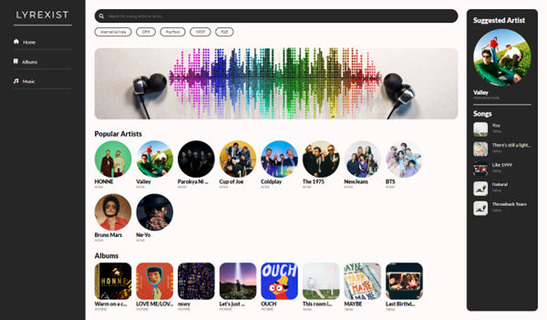
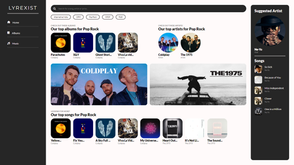
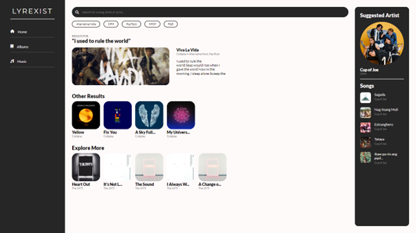
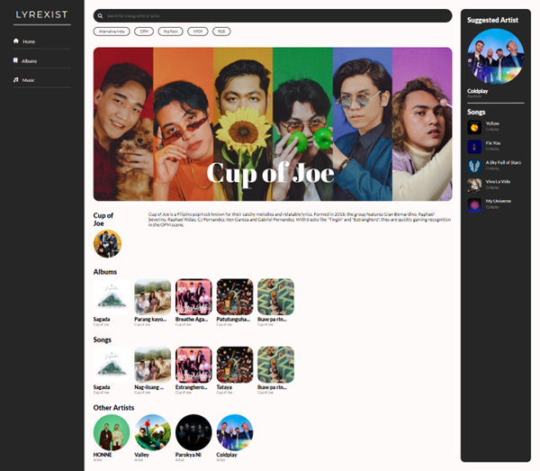
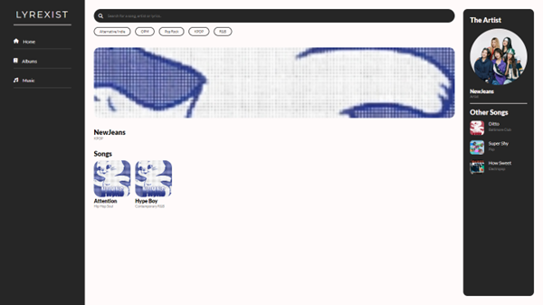
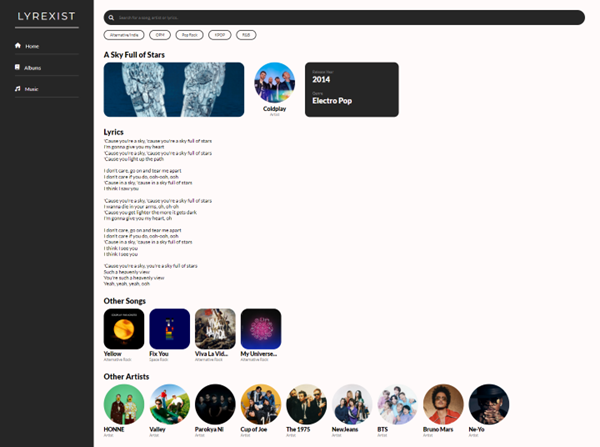

# Lyrexist - A Song Search Web Application
Lyrexist is a dynamic web application we made as a group final project for our Advanced Database (ADDBASE) course. It is designed to showcase practical application of NoSQL databases using Firebase Firestore. It is a song search engine that allows users to search for songs by partial lyrics, song titles, artist names, and other attributes such as genre and release year.

## Starting the Web Application
1. Ensure that all dependencies are installed by running:
   ```
   npm install
   ```
2. Once all files are properly downloaded and installed, open the `index.html` file in Visual Studio Code and run it by using the Live Server extension. Otherwise, it would not be able to communicate with the cloud database or Firestore.

    *Note: Our Firestore database will stop working once the time has passed after submitting this as a requirement for our course. Database access will get restricted to prevent misuse.*

3. The app will be running on the port specified by Live Server.

## Web App Structure
### A. Homepage


The homepage of Lyrexist serves as your gateway to music discovery.

The top most part contains the **Search Bar**, allowing you to look for lyrics and see recommended songs based on song titles, artist names, albums, and release years. See [Section C](#c-search-by-lyrics).

Below the search bar are the **Filter by Genre** clickable buttons to show songs that are relevant to your preference (Available genres include: Alternative/Indie, OPM, Pop Rock, KPOP, and R&B). See [Section B](#b-filter-by-genre).

The **Navigation Pane** on the left allows you to go to specific pages of the app. However, only the Home page is accessible given the scope of the project.

The **Suggested Artist** on the right side will show you a randomly selected artist that can be of interest to you. You can click on the artist’s profile picture to be redirected to the artist’s page or the pictures of their songs to be redirected to the selected song’s lyrics page.

The **Popular Artists** and **Albums** sections are also visible in the homepage for you to explore.

### B. Filter by Genre


To show songs relevant to your preference, you can click the genre filters below the search bar.

### C. Search by Lyrics


When searching for lyrics, you will see relevant song matches on the results page.

### D. Artist Page


In this page, you will see the information about the artist such as the albums, songs, as well as other related artists.
Similar to the homepage, the sidebar on the right side shows a suggested artist.

### E. Album Page


Here you will see the songs associated with the album. However, given that the database only consists of 50 songs currently, with one to two songs only per album, the album page will only display the songs that exist in the database.

On the sidebar on the right side, it shows the artist’s profile. Clicking on the artist will take you to the artist page. Below the artist, it displays other songs from the same artist. Clicking on any of these songs will take you to that specific song’s lyrics page.

### F. Lyrics Page


In this page, you will see song information such as the name of the song, artist, release year and its genre. You will also find the lyrics of the selected song on this page. 

## Development Team
| Name | Role |
| --- | --- |
| [Cayanan](https://github.com/lmcay) | Front-End Developer |
| [David](https://github.com/K8Dvd) | Creatives and Research |
| [Natividad](https://github.com/itsjayceee) | Creatives and Research |
| [Navarro](https://github.com/navarroangelo) | Back-End Developer |
| [Tayag](https://github.com/cjt22) | Back-End Developer |
| [Valdez](https://github.com/jimvdz) | Front-End Developer |

Copyright &copy; 2024 by Cayanan, David, Natividad, Navarro, Tayag, and Valdez. All rights reserved.